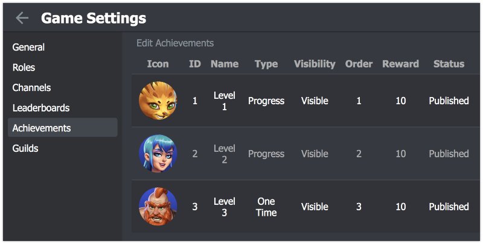
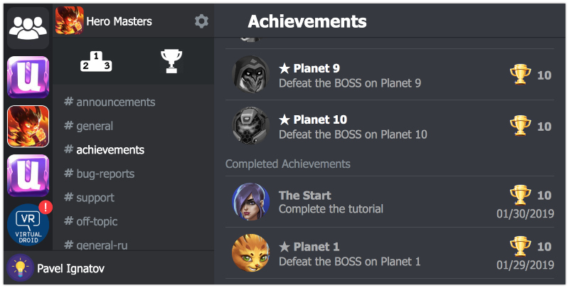

# Achievements

Achievements can be a great way to increase your users' engagement within your game. You can implement achievements in your game to encourage players to experiment with features they might not normally use, or to approach your game with entirely different play styles. Achievements can also be a fun way for players to compare their progress with each other and engage in light-hearted competition.

Manage Achievements:

1.  Open your game settings
2.  Select achievements section
3.  Add/Remove and Edit achievements here


Once you add at least one achievement - all players will see the Achievements button in the main navigation.

For your convenience we've recorded the [small video tutorial](https://youtu.be/7lSqoOWwSdM)

### Achievement Parameters:

* **Name** - displayed name of the achievement;
* **Description** - the information of how a player can receive the achievement;
* **Achievement Type**:
    + **Progress** - game client always reports his absolute progress for such achievement. Once he reaches the goal - achievement is completed.

        Example: "Collect 30 different cards in your deck".
        Whenever a player's deck changes, game client calculates the amount of different cards in the deck and reports it to UnnyNet.
    
    + **Incremental** - game client reports only the changes of the progress. UnnyNet takes care about the absolute value for such achievement.
    
        Example: "Spend 10,000 gold".
        Whenever a player's spend gold, game client reports the amount spent only. UnnyNet stores the total amount of gold spent, so you don't have to think about that.
    
    + **One Time** - a type of achievement without a progress. Once game client reports it - the achievement is complete.
    
        Example: "Find an epic card in loot boxes".
        There is no progress in such achievements, you either find it or not.
    
* **Scores to complete** - the amount of scores required to complete an achievement. One Time achievements don't have this field;
* **Visibility** - a hidden achievement means that details about the achievement are hidden from the player. We recommend making an achievement hidden if it contains a spoiler you don't want to reveal about your game too early. Despite the visibility, players will see the achievement once it's completed;
* **Order** - this number is used to sort the achievements in the way you want. Achievements with the lowest order are displayed at the top;
* **Reward Points** - The amout of points a player gets when the achievement is completed.
* **Published** - unpublished achievements are not visible and can't be completed by a player;
* **Icon** - must be 512x512 or 1024x1024 image. UnnyNet automatically crops it to a circle. Please use colored pictures, because UnnyNet applies grayscale style for uncompleted achievements.

### Achievements UI

This is how players see the achievements in the game:


### Report Achievements
All types of achievements have the same method to report the progress:

```csharp fct_label="Unity"
UnnyNet.UnnyNet.ReportAchievements(6, 99);
```

```js fct_label="Java"
unnynet.reportAchievements(6, 99);
```

The first parameter ("6" in the example) is the id of the achievememt. It assigns to an achievements once the achievement is created, and you can find it in the achievements table of game settings.
The second parameter ("99" in the example) differs for each type of achievement:

* **Progress** - the absolute value of the progress for the achievement.
* **Incremental** - the changes of the progress for the achievement.
* **One time** - the value is ignored. You can send anything here.

### Achievement Completed
You can subscribe for the event to be notified, when a player completes an achievement
```csharp fct_label="Unity"
UnnyNet.UnnyNetBase.m_OnAchievementCompleted = (prms) =>{
    Debug.Log("On Achievement Completed by id " + prms["ach_id"]);
};
```

```java fct_label="Java"
unnynet.setOnAchievementCompletedListener(achId -> 
    showMessage("Achievement Completed: " + achId)
);
```
