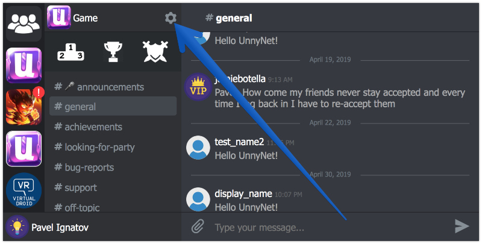
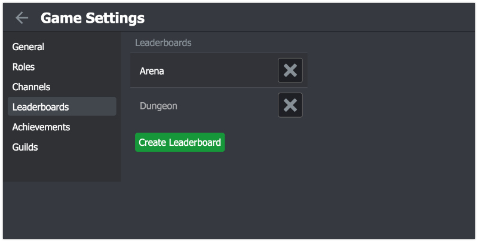
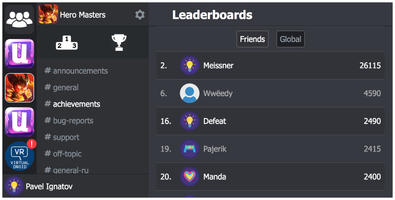

# Leaderboards

Leaderboards are a great way to add a social and competitive element to any game. They're a fun way to drive competition among your players.

The server has no special requirement on what the score value should represent from your game. A leaderboard is created with a sort order on values. If you're using lap time or currency in records you'll want to order the results in ASC or DESC mode as preferred. At creation time you must also specify the operator which controls how scores are submitted to the leaderboard: "best" or "set".

For your convenience we've recorded the [small video tutorial](https://youtu.be/fvbJznVhaw0)

### How to add Leaderboards
1.  Open Game Settings window
    
2.  Select Leaderboards section
    
3.  Click on "Create Leaderboard" Button
    
When a player completes a level or makes any other important action, use the next method to report his scores to UnnyNet:

```csharp fct_label="Unity"
UnnyNet.UnnyNet.ReportLeaderboards("leaderboard_id", 99);
```

```csharp fct_label="JavaScript"
UnnyNet.UnnyNet.reportLeaderboards("leaderboard_id", 99);
```

```java fct_label="Java"
unnynet.reportLeaderboards("leaderboard_id", 99);
```

You can find leaderboard_id on the leaderboards page in the game settings.

### Leaderboards UI
UnnyNet displays Global Leaderboards and also Leaderboards only for Friends:
    
