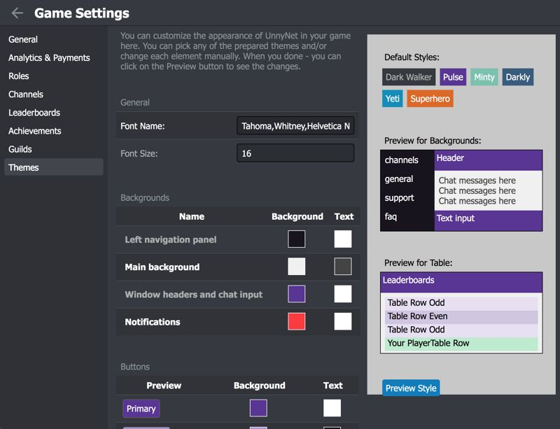

# Theme Customization

Every developer wants the chat, leaderboards and other features we provide feel and look like a part of the game.
We truly understand and support it. That's why we have a theme customization, which you can already use.

You can change fonts and colors for each element. This is just a start and we'll be improving this feature giving you more flexibility.

For your convenience we've recorded the [small video tutorial](https://youtu.be/zMfibj8hhGI)

### How to add Leaderboards
1.  Open Game Settings window
2.  Select Themes section
    
3.  Here you can change the background and text color for all elements, and also change the font.
4.  There is a preview on the right.
5.  After your save the changes, you can relaunch the app on your device to see the changes or click on the Preview button. 
