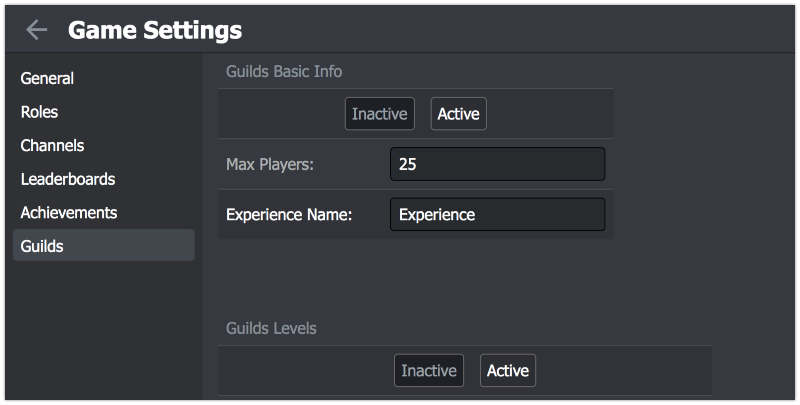
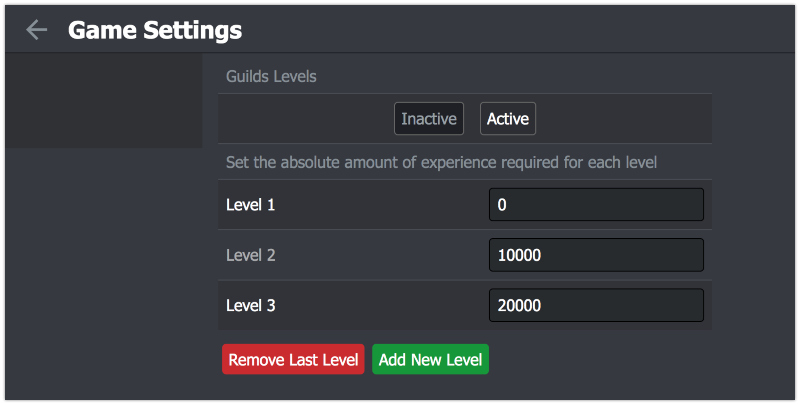
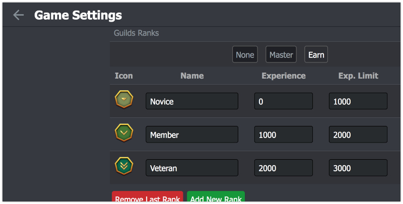

# Guilds Setup

1.  Open your game settings
2.  Select Guilds section

In the next window you'll find all the settings for the guilds. Don't forget to click on "Save" button when you finish editing.

### Guilds Basic Info

1.  Click on **Active** button to turn on the guilds for the game
1.  **Max Players**
    Each guild has the same limit for players. As a game developer, you have to specify this limit. You can change the limit after the release, but it's a bad practice, because the changes won't affect already existing guilds
2.  **Experience Name**
    If your game has levels for guilds or ranks for guild members, they'll be donation something to the guild in order to progress. Depending on your game, the donation might have different meaning. It can be Experience, which players earn in battles or it can be Gold, which players donate every day. It's up to you to decide how to call it

### Guilds Levels

Levels are optional, but a very common feature for a modern game. Players are ready to spend enormous amount of time to keep their guild growing, so levels is a great visual representation of guild's progress We use the word Experience as the most common word, however as it was said above you can name it anything for your players: Gold, Magic, Souls, Battles,...

1.  Click on **Active** button to turn on levels for guilds
2.  **Experience**
    Here you can change the amount of levels your guilds have and how many experience required to get to each level

### Guilds Ranks

Ranks help a guild to create a hierarchy, organize it's players and bound them together. Any player feels appreciated when he has a high rank.
There are 3 types of Ranks:

1.  **None** - ranks are not available
2.  **Master** (Not available yet) - guild master gives ranks to other players
3.  **Earn** - whenever a player adds experience to his guild, he also gets the same amount for himself. The experience adds up to new ranks

If you activate any type of Ranks, you'll see the table, where you can add, remove and edit each rank:

1.  **Icon** - an image, which represents the rank. It's displayed in all the guilds window
2.  **Name** - the name of the rank
3.  **Experience** (Earn Ranks only) - the amount of experience required for this rank
4.  **Daily Limit** (Earn Ranks only) - the experience limit a player of this rank can donate to his guild every day
5.  **Exp Scale** (Earn Ranks only) - the multiplier for all the experience earned. This value lets high rank players to earn more experience. The default value is 1

When you are satisfied with the settings, click on the "Save" button to apply the changes. You can change all the settings at any time, even after the release, however that might give your players a bad experience, so please do that wisely.

#### [Now we can go straight to test everything](/advanced/guilds/guilds_test)
