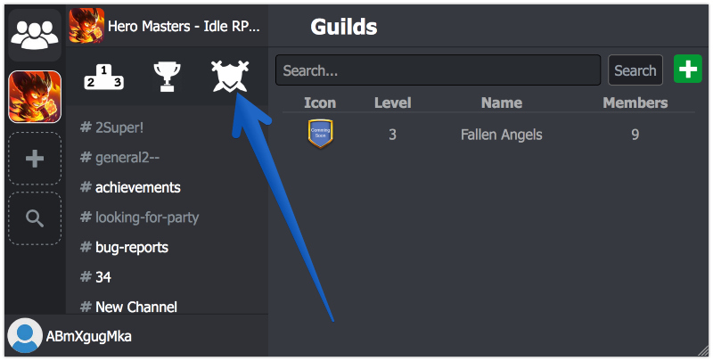
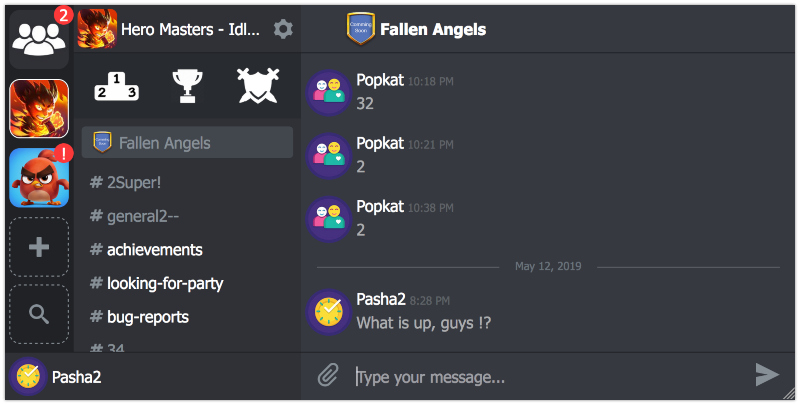
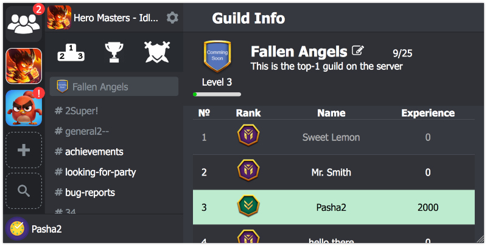

# Guilds Test

This section aims to show developers what players are going to see in the game. It also helps developers to have a clear picture of how everything works.

Guild creation is available only from the game. It was made on purpose: you might want to make guild creation a paid feature, so to approve a new guild you'll have to check the balance first and then charge the price. All other guild features can be tested in the browser.

### Search for a guild
When the guilds are activated, players will see a new icon in the navigation panel

The new button leads to a new Guilds window, where players can search for all guilds in the game, view or join them, and also create their own guilds.

### Create a guild
Guild creation is extremely straightforward. Click on the green "+" button in the Guilds window, choose a name, description and whether the guild is Private or Public:

* **Public** - any player is able to join the guild;
* **Private** - a player has to be invited by the creator or send a request to join the guild.

### Guild's chat
When a guild is created, the player will see a new Chat channel in the navigation. It's separated from other channels and has guild icon to the left, so they won't mix it with other channels. This is a private chat channel only for guild members.

### Guild's window
To open My Guild window, a player has to click on the Guild name at the top of the guild's chat channel:

In this window players can see full list of all guild members, their ranks and the amount of Experience they donated during the last time.

#### [When you satisfied, we are ready to move to API section](/advanced/guilds/guilds_api)
