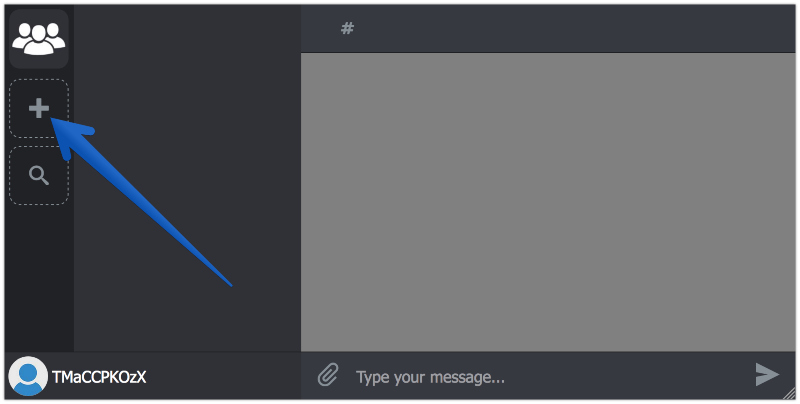

# How to start

1.  Create an account at [UnnyNet](https://unnynet.com)
2.  You'll be offered to add a game. If you missed the window, click on the Plus icon on the left
    
3.  If you game is already available on GooglePlay, you should choose **GooglePlay Import** option and add your game with just BundleId.
Otherwise you can manually add your game by clicking **Add Game**. You'll need to specify game's name and upload it's icon (512px - 1024px)  

4. Select your platform and follow the instructions:

    1. [Unity](/basic/integration_unity3d).
    2. [Android](/basic/integration_android).
