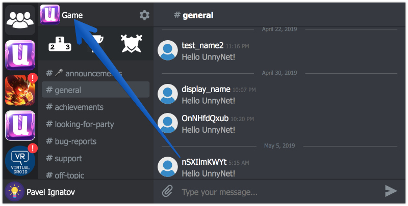
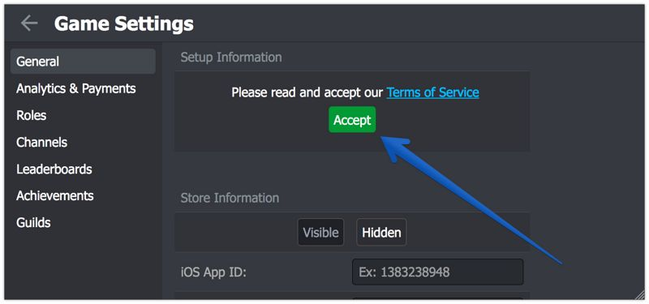

# Unity3D Integration


1.  Download the latest version of the library from the [github](https://github.com/unnynet/unnynet-android/releases). *Later we will publish it to JCenter or Maven Center*.
2.  Add library to a project.
3.  In the assets folder create file **unnynet.data.json** with content:

    ```
    {
      "gameId":"your_game_id"
    }
    ```
    
    Here you can also setup addition settings:
    
    ```
    {
      "guests_allowed": true,
      "game_login": true,
      "default_channel": "general",
      "open_fade": true,
      "open_animation": 2,
      "close_fade": true,
      "close_animation": 2,
      "gameId":"your_game_id"
    }
    ```
        
    You can find your Game ID here:
    
    

4.  Init UnnyNet:

    ```
    unnynet = new UnnyNetDefault(this);
    ```

5.  Call the next method to show UnnyNet window:

    ```
    unnynet.show()
    ```


###Congratulations!

Your game is a part of UnnyNet now and your players are happy!
