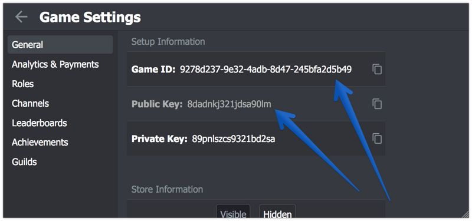

# Unity3D Integration

For your convenience we've recorded the [video of the integration](https://youtu.be/ql6h1WTBj5I)

1.  Download the latest version of the plugin from the [Asset Store](https://assetstore.unity.com/packages/slug/128920).
2.  Import the UnnyNet plugin.
3.  Prepare Game ID and Public Key to use in the code:

    
    
    Read and accept Terms of Service first:
    
    
    Copy and paste Game ID and Public Key: 
    

4.  Call initialize method at start:

        
        UnnyNetNewInit.Init(new AppConfig {
            GameId = "8ff16d3c-ebcc-4582-a734-77ca6c14af29",
            PublicKey = "...",
            Environment = UnnyNet.Constants.Environment.Development,
            OnReadyCallback = responseData => { Debug.Log("UnnyNet Initialized: " + responseData.Success); }
        });
        
5.  Call the next method to show UnnyNet window:

        UnnyNet.MainController.Open();

        
6.  In the Player Settings set for Android Minimum API Level to at least 19, for iOS Target minimum iOS Version to at least 8.0.

### Further reading

UnnyNet consists of several modules for your convenience.

1. **Auth** - authorizations
2. **Payments** - purchase In-App and get information about them
3. **Storage** - a place to work with Data Editor and to save/load in-game data with the server
4. **Localization** - (coming soon) a place to work with localizations
