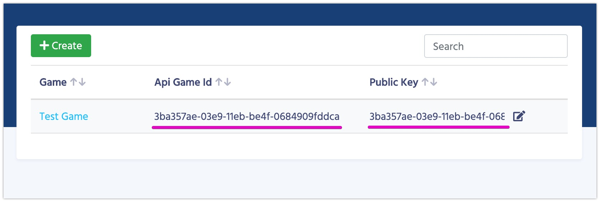

# Unity3D Integration

For your convenience we've recorded the [video of the integration](https://youtu.be/ql6h1WTBj5I)

1.  Download the latest version of the plugin from the [Asset Store](https://assetstore.unity.com/packages/slug/128920).
2.  Import the UnnyNet plugin.
3.  Prepare Game ID and Public Key to use in the code:

    

4.  Call initialize method at start:
        
```csharp fct_label="Unity"
UnnyNet.Main.Init(new UnnyNet.AppConfig {
    ApiGameId = YOUR_GAME_ID,
    PublicKey = YOUR_PUBLIC_KEY,
    Environment = UnnyNet.Constants.Environment.Development,
    OnReadyCallback = responseData => { Debug.Log("UnnyNet Initialized: " + responseData.Success); }
});
```

### Further reading

UnnyNet consists of several modules for your convenience.

1. **Auth** - authorizations
2. **Payments** - purchase In-App and get information about them
3. **Storage** - a place to work with Data Editor and to save/load in-game data with the server
4. **Localization** - (coming soon) a place to work with localizations
