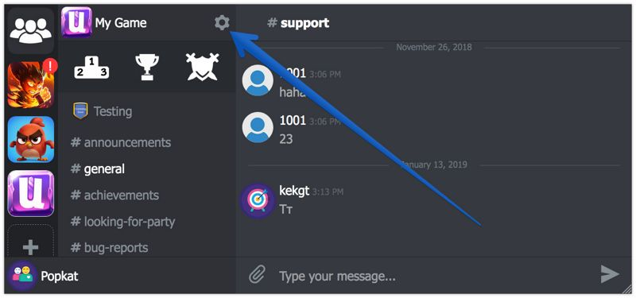
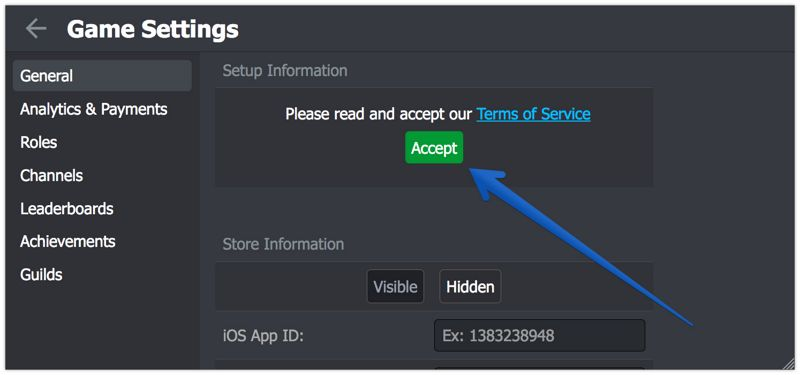

# Unity3D Integration

For you convenience we've recorded the [video of the integration](https://youtu.be/ajnHBpC8r5A)

1.  Download the latest version of the plugin from the [Asset Store](https://assetstore.unity.com/packages/slug/128920)
2.  Import the UnnyNet plugin
3.  In the Unity's Title Bar click on UnnyNet->Settings and set the your Game ID
    
    You can find you Game ID here:
    
    

4.  Call initialize method at start:

        UnnyNet.UnnyNetBase.InitializeUnnyNet();

5.  Call the next method to show UnnyNet window:

        UnnyNet.UnnyNetBase.OpenUnnyNet();

6.  In the Player Settings set for Android Minimum API Level to 20, for iOS Target minimum iOS Version to 8.0.

Once you make an Android or iOS build - everything will work like magic. Unfortunately you can't test it in Unity yet, but we are working on it.

### Android additional settings

UnnyNet allows users to exchange photos and screenshots thus we need to request a permission to do that. 
It is a good practice to request such permission at runtime [Android Documentation](https://developer.android.com/training/permissions/requesting#explain). 
As an App can't request some permissions at start and some at runtime, we urge you to request the permission you need at runtime as well. 
You can use our class UnityAndroidPermissions (method RequestPermission) for this.

Please add the next permission to your Android Manifest:

    <uses-permission android:name="android.permission.WRITE_EXTERNAL_STORAGE" />

###Congratulations!

Your game is a part of UnnyNet now and your players are happy!
