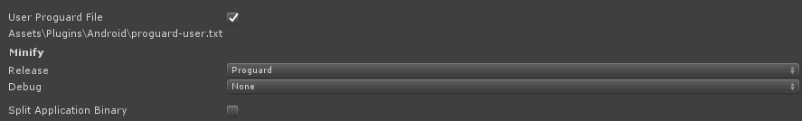

# Proguard settings

If you are enable minification with proguard, you have to setup it to keep UnnyNet classes in result build. 

1) Enable User Proguard File.
    


If you don't have this file, create it.

2) And add this lines into **Assets/Plugins/Android/proguard-user.txt**:

```java
-keep class com.unnynet.webview.** { *; }
-dontwarn com.unnynet.webview.**
-keep class com.unnynet.android.helper.** { *; }
-dontwarn com.unnynet.android.helper.**
```