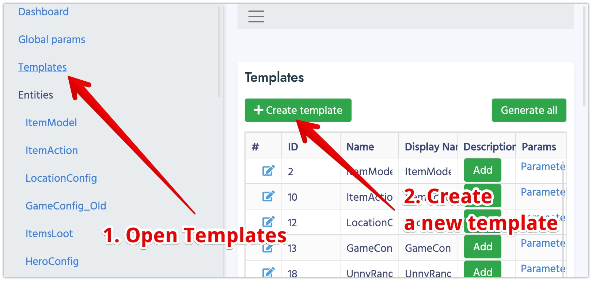

# Templates

**Template** describes the structure and behaviour of your game object (item, monster, construction,...). As a programmer you can think of it as a **Class**. Template has to have a unique name and a set of parameters.

1.  Open Templates section and click on the Create Button

    
2.  Each Template has several parameters
    
    Name | Description
    -----|------------
    **Name** | This very name is used for Class generation. To keep everything is style we advise you to use [CamelCase](https://simple.wikipedia.org/wiki/CamelCase) naming.   For example: ItemModel, GameConstruction, MonsterData,...
    **Display Name** | The name which will be displayed in the CMS. Usually it's the same as name, but words are separated.   For example: Item Model, Game Construction, Monster Data,...
    **Description** | Helps other team members to easily understand what this Template is used for.
    **Base Template** | It's used if your Template inherits from another one. (This feature is under development)
    **Type** | Can be Default, Component or Singleton:    *   **Component** Documents of this Template are always embedded into another Documents. For example Vector3 component template has parameters: x, y, z. If a Document "Hero" has a Parameter "position" of type Vector3, you'll be able to edit x, y, z values of "position" right inside of "Hero" Document.   *   **Singleton** Only one of such Documents will be available in the code. It's usually used for settings and configs.  

#### [Next: Parameters](/cms/getting_started/parameters)
