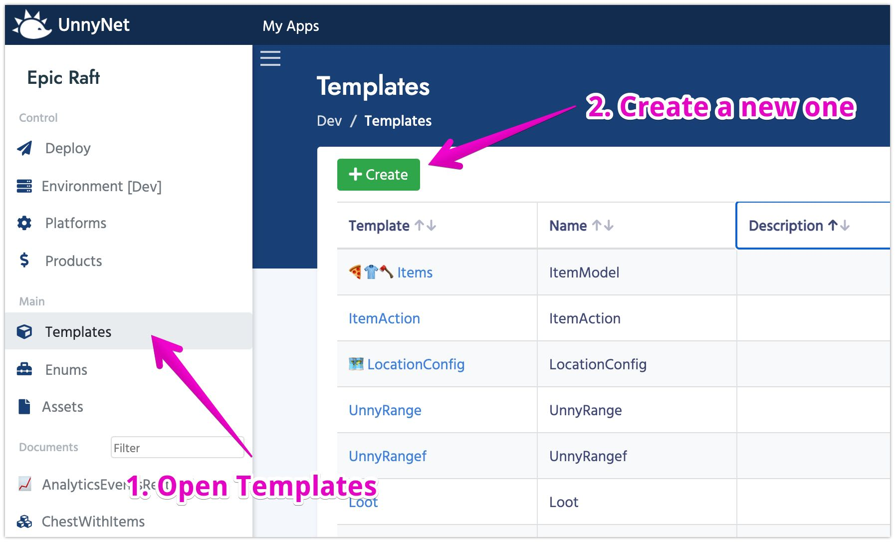

# Data Editor usage Example

In this example I'm going to show you how you can create a simple craft logic for your game. We gonna need just several Templates: Item, Recipe and Ingredient.
I assume you've read and implemented [the basics](/basic/basic) for your game.

### Templates preparation

1. Open Data Editor
2. Select Templates Section and click on Create Template

3. Set **Name** as "Item" and leave other fields as default.
4. Add following parameters:
    * **Name**: (Type: String, Use in display name - YES)
    * **Description**: (Type: String)
    * When you done, the list of parameters should look like this:
    
5. Create another Template for Ingredient. We'll make it Component for the convenience.
    * **Name**: Ingredient
    * **Type**: Component
6. Add following parameters:
    * **Item**: (Type: Reference, Reference Template: Item)
    * **Count**: (Type: Integer, Default value: 1)
    * When you done, the list of parameters should look like this:
    
7. The last template we gonna need is Recipe. Set **Name** as "Recipe" and leave other fields as default.
8. Add following parameters:
    * **Item**: (Type: Reference, Reference Template: **Item**)
    * **Ingredients**: (Type: List, List Type: Reference, Reference Template: **Ingredient**)
    * When you done, the list of parameters should look like this:
    

### Create documents

Now, as we have our Templates ready, we need to add couple of actual items and recipes. When you added the Templates, you should've noticed that in the navigation (on the left) two new section appeared: Items and Recipe. Ingredient doesn't show up because it's a Component and exists only within another Document. 

1. In the Navigation Panel select **Items**
2. Click on the **Create** button to add a new Item
3. Create 3 items as shown below:  


Now we going to make a recipe to create a Hammer using a Rock and a Wood:

1. In the Navigation Panel select **Recipe**
2. Click on the **Create** button to add a new Recipe
3. Select Item parameter as Hammer
4. Add 2 ingredients: One Wood and one Rock
5. It means that in order to create a Hammer, you need to spend one Wood and one Rock

Ok, we set all the data we need to the test project. Now we just need to publish our changes.

### Deploy

1. Select Deploy section in the Navigation Panel
2. Click **Generate All** and wait couple seconds until it's done

Every time you make any changes in the data, it'll be saved only inside of the Editor. If you want to push the changes to the game, you can to do that in the Deploy Section. As a programmer, you can think of it as commit/push in GIT system.

### Code Generation

1. Open Unity Project
2. Import [UnnyNet plugin](https://assetstore.unity.com/packages/slug/128920)
3. Open editor window Tools->UnnyNet
4. Input your GameId and PublicKey
5. Click on **Generate Code**
6. It might take several seconds
7. Once it's done, you can find a new folder with several scripts created at /Assets/UnnyNet/AutoGeneratedCode
8. Don't change anything in that folder. The changes will be lost with the next generation


### UnnyNet Initialization

You should read more about UnnyNet initialization [here](/basic/integration_unity3d)

1. Create a new script DataEditorExample.cs
2. Create a new scene and add this script to the Main Camera.
3. In the Start method write the following code:

```
UnnyNet.UnnyNetNewInit.Init(new UnnyNet.AppConfig
{
   ApiGameId = YOUR_GAME_ID,
   PublicKey = YOUR_PUBLIC_KEY,
   Environment = UnnyNet.Constants.Environment.Development,
   OnReadyCallback = responseData =>
   {
       Debug.Log("UnnyNet Initialized: " + responseData.Success);
   }
});
```
       
### Validate Data

First, lets check if we receive correct data from the Editor.
Add those methods to our script:

```
private void PrintAllData()
{
    PrintItems();
    PrintRecipes();
}

private void PrintItems()
{
    var items = UnnyNet.Storage.Items;
    Debug.LogWarning("Items Count = " + items.Count);
    foreach (var item in items)
        Debug.Log("ITEM: " + item.Name + " : " + item.Description);
}

private void PrintRecipes()
{
    var recipes = UnnyNet.Storage.Recipes;
    Debug.LogWarning("Recipes Count = " + recipes.Count);
    foreach (var recipe in recipes)
        Debug.Log("RECIPE to create item " + recipe.Item.Name + " requires " + recipe.Ingredients.Length + " other items");
}
```
        
Now we just need to call **PrintAllData** once UnnyNet was initialized. Call this method after the Log line:

```
Debug.Log("UnnyNet Initialized: " + responseData.Success);
PrintAllData();
```
        
Launch the game and you should see the following logs in the console:


### Write Craft Logic

The next step is to write some logic to store the items you have and spend items to make a craft items. I'll provide the whole code listing, so you could investigate it. Keep in mind that this example was made super easy on purpose. For the real project you would definitely want to organize the code better. And don't forget about [SOLID principles](https://en.wikipedia.org/wiki/SOLID).
Good luck with coding!

[DataEditorExample.cs](/code/DataEditorExample.cs) 

### Offline Games

If your game is offline, you might assume that the game could be launched the first time without an access to the internet. In such situation you can't rely that the game balance will be delivered to the build.

1. Open editor window Tools->UnnyNet
2. Click on **Download Data**
3. All the latest game data from Editor will be downloaded and put into /Assets/UnnyNet/Resources
4. If your game is launched without an internet access, it'll use the data from the resources
5. Once internet is available the data will be automatically updated if necessary

#### [Next: What's next](/data_editor/what_next)
