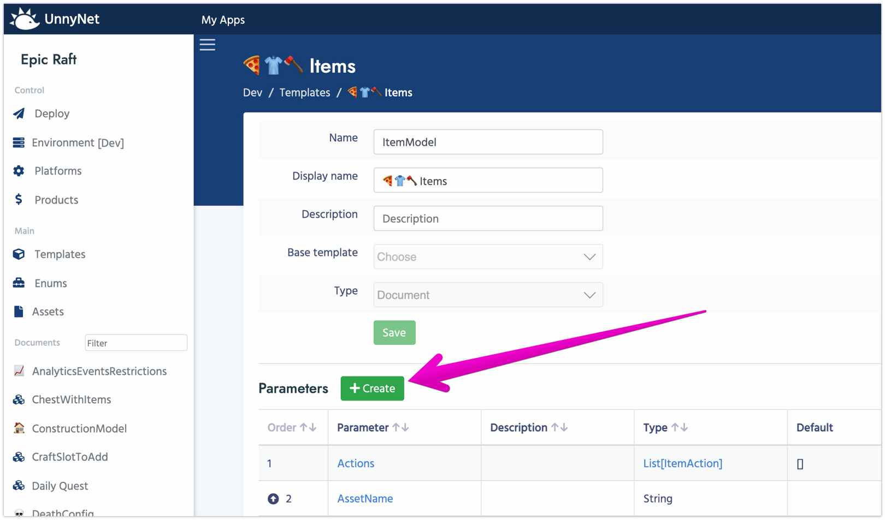

# Parameters

**Parameter** describes a part of a Document, storing some value. Each parameter has a name and a type. Type can be simple like string, int, float, bool or a reference to any other Template. As a programmer you can think of parameter as a **Field** or **Property** of the **Class**.

1.  After the creation of a template, you can add parameters to it.

2. In the parameters window you can view/edit all existing parameters and add new one.
    
2.  Each Parameter has several fields:

    Name              | Description
    ------------------|------
    **Name**          | This very name is used during Class generation. To keep everything in style we advise you to use [CamelCase](https://simple.wikipedia.org/wiki/CamelCase) naming.   For example: MainTag, ConstructionId, HeroType,...
    **Display Name**  | This name will be displayed in the DE for your convenience.   For example: Main Tag, Construction Id, Hero Type,...    
    **Description** | Helps other team members to easily understand what this Parameter is used for.
    **Use In Display Name** | Means that this parameter will be displayed in search and references for the corresponding Document. Usually **Name** (if any) or any other unique string parameter is selected for this or any other, which will help you instantly understand what instance is that.
    **Is required** | Marks this parameter as a must have value. This flag helps you to make sure you won't forget to add a required reference or value.
    **Is unique** | It's used in case you want all of your Documents of this Template to have different values of this parameter.
    **Default Value** | The value which will be assigned by default upon a new document is created.
    **Type** | A Data type of the parameter. All types are below.
        
    Type | Description
    -----|------------
    [Integer](https://en.wikipedia.org/wiki/Integer) | A Number that can be written without a fractional component. For ex: 1, 2, 999, -200
    [String](https://en.wikipedia.org/wiki/String_(computer_science)) | Any Text. For ex: "Hello World", "-+ ta-ta_!! 55"
    [Float](https://en.wikipedia.org/wiki/Single-precision_floating-point_format) | A Number with a fractional component. For ex: 1.32, -0.7432
    [Boolean](https://en.wikipedia.org/wiki/Boolean_data_type) | Logical value: true or false
    Reference | A reference to an existing document
    List | An Array(list) of other type values  

#### [Next: Documents & Components](/data_editor/getting_started/documents)
