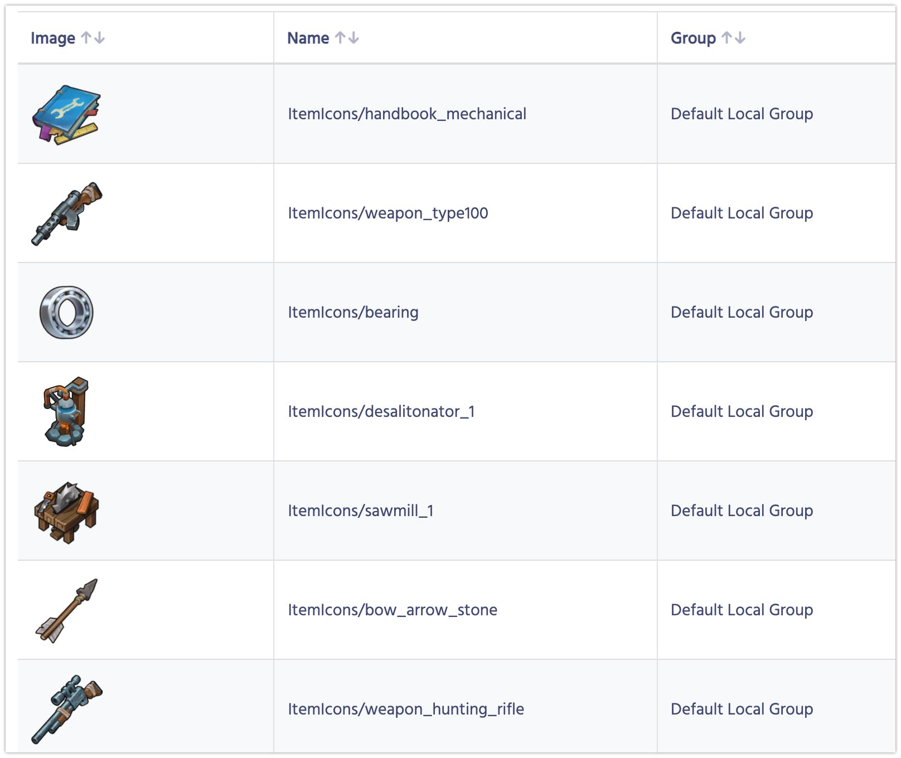
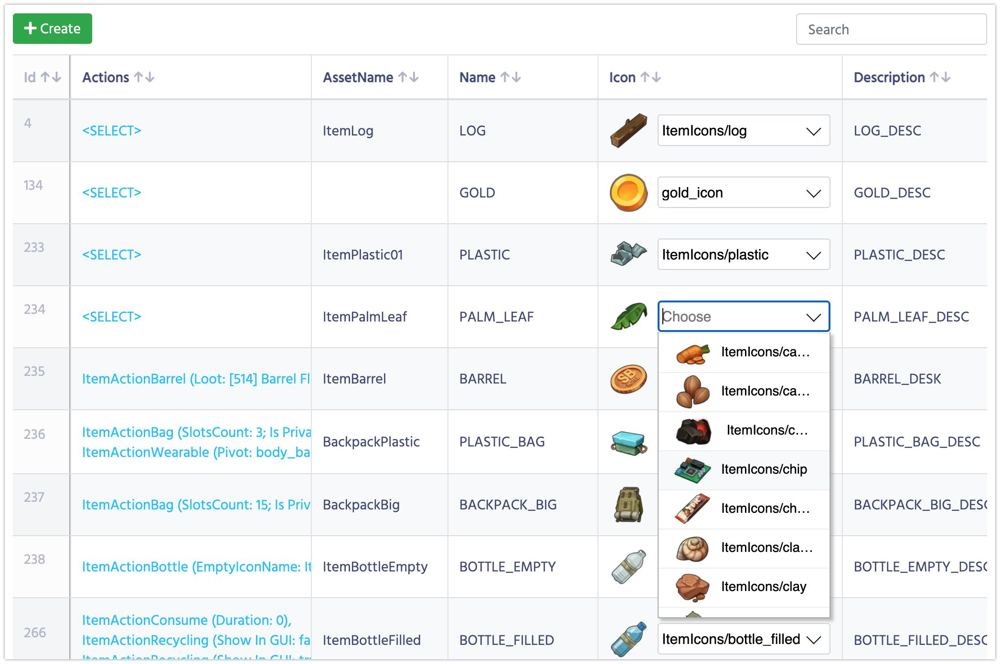

# Assets

Assets are all objects which you store in Addressables. If you are not using Addressables in your game you should ignore this page or better start using them.

1. In Unity Open **UnnyNet->Tools** and click on **Synch Addressables**.
2. The synchronization process starts.
3. UnnyNet detects which addressables were changed after the last synchronization and uploads images for the new/updated files only. It means that the first synchronization might take some time, while all subsequent will be faster.
4. After the process is done open **Assets** section in DE and you should see the list of all your Assets.
    

5. If you have any parameter of type **Asset**, you'll be able to pick it from the dropdown menu:
    

6. In the generated code your parameter will have the type **UnnyAsset**. For now it has only one field **Name**, which is enough for a developer to load the addressable.