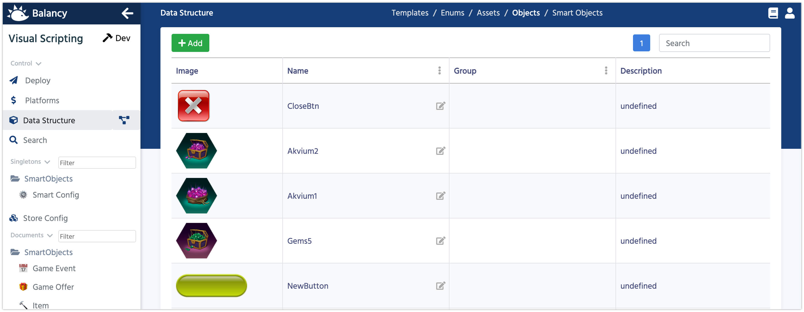

# Data Objects

Data Objects are the files that you can upload to the CDN using Balancy. All the files will be delivered at run-time and can be used by the game. Currently we allow to upload only images(PNG an JPEG).

1.  When you create a new [parameter](/data_editor/getting_started/parameters) select a type **Data Object**.
2.  Now you can add links to your uploaded images in documents.

### Section for programmers

Code generator set Data Objects parameters type to UnnyObject. It has a method **LoadSprite** to load the sprite asynchronously. All the images are cached in PersistanceDataPath.

  

