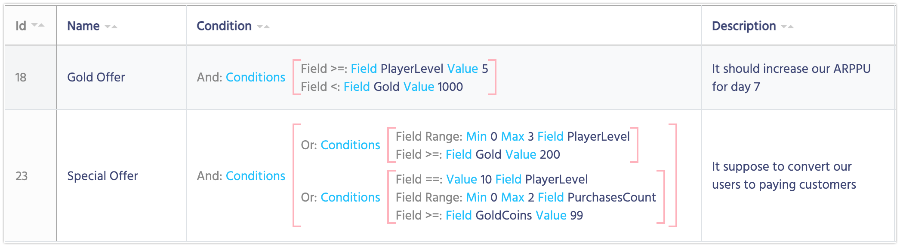
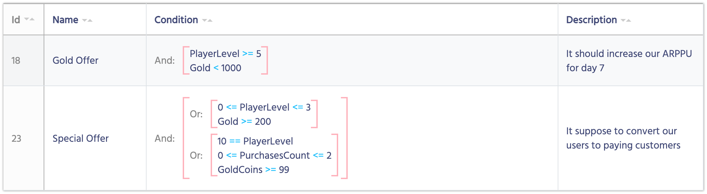

# Display Format

Imagine you have a very complex structure of conditions based on Components. It should look something like this:

You can easily change the way how your components are displayed without making any changes in the logic.

1. Open Template, which display view you want to change.
2. Select **Custom display format**
3. **Display format** becomes available for editing
4. Use the following code to customize the display:

    Name              | Description
    ------------------|------
    **{template.displayName}**          | Display Name of the component will be placed instead
    **{< Parameter Name >}**  | Place a Parameter Name into the brackets {} and it will be replaced with the parameter's actual value
    **any string** | Any other information is left without any changes. You can use strings, numbers or any symbols

<iframe width="560" height="315" src="https://www.youtube.com/embed/eiNQBAZYswk" title="YouTube video player" frameborder="0" allow="accelerometer; autoplay; clipboard-write; encrypted-media; gyroscope; picture-in-picture" allowfullscreen></iframe>
