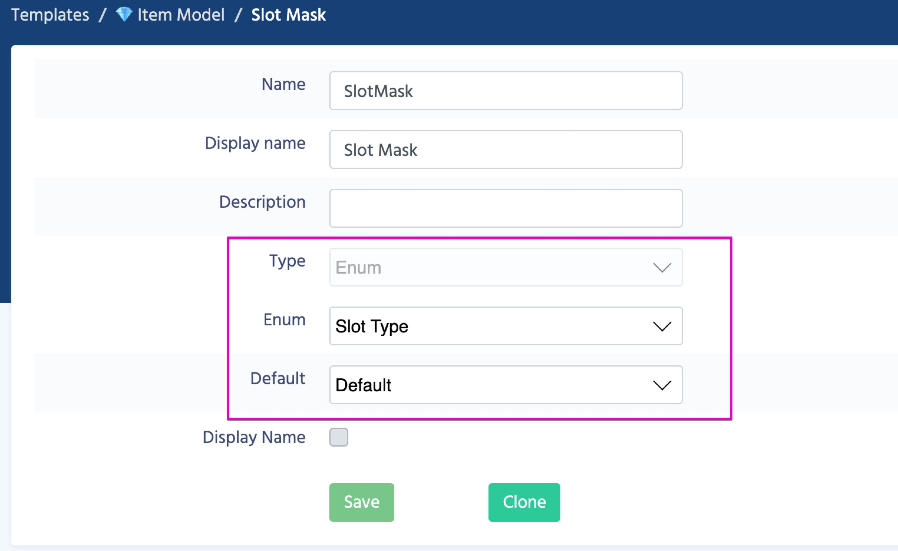

# Enumerated Types (enums)

### Overview

[Enumerated types](https://en.wikipedia.org/wiki/Enumerated_type) are widely used in programming. When you have a limited list of possible values, it's often convenient to use **enum** instead of **int** or **string**.

##### For example:
If you have a limited set of Colors to choose in your game, you might want to store the value as integer (1,2,3,4,...) to save memory. However, you can define a new enum, which will make your values more readable and convenient to use.

```
public enum Color
{
    Red = 0,
    Green = 1,
    Blue = 2,
    White = 3,
    Black = 4,
}
```

Now you can use values, like **Color.Blue** in your code instead of **2**.

### How to create enum

1. Select **Data Structure** section.
2. Switch to **Enums** subsection.
3. Click on **Create** button


4. Each Enum has several parameters
    
    Name | Description
    -----|------------
    **Name** | This name is used when you work with your enum from code.
    **Display Name** | The name which will be displayed in the DE.
    **Description** | Helps other team members to easily understand what this Enum is used for.
    **Multi-selection** | Defines if a parameter can contain multiple enum values. 
    
5. Table of Values

    Each enum value must have a unique name and a unique value associated with the name. If you are using Multi-selection, all the values must be power of 2 or be equal zero.

6. When you create and save your enum, you can choose type Enum for a parameter.


#### [Next: Deploy](/data_editor/deploy)
