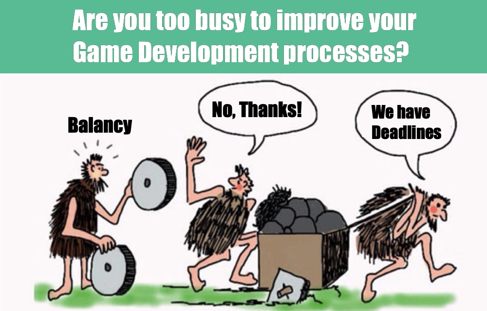

# Welcome to Balancy

Balancy is an essential extension for any game or app. Instead of using ancient solutions, you can spend several minutes learning what Balancy does and how it works. Which in results will save you weeks and months of time in the future.  

We've spent more than a decade in Game Dev Industry, creating tons of different games, so we know the problem you are facing right now. Our main goal is to prevent game developers from reinventing the wheel, developing the same technology over and over with each new game. That's why our solution is super easy to use and it does most of the work on your behalf.

Our core feature help you to organise and to deliver Game Balance Data. Many more features are coming. 

Our servers are designed to run at massive scale, and scale automatically with your user base. We have your back, so we expect from you to focus on the game itself and make it awesome.

Watch Video
-
<iframe width="560" height="315" src="https://www.youtube.com/embed/KsJN0yzuNBA" title="YouTube video player" frameborder="0" allow="accelerometer; autoplay; clipboard-write; encrypted-media; gyroscope; picture-in-picture" allowfullscreen></iframe>

[Join Our Discord](https://discord.gg/X27tuQR)

###[Out-of-the-box](/basic/basic)

Integration of Balancy is extremely easy and takes not longer than 10 minutes. Instead of wasting your time on implementing features which any other game already has, focus your energy on creating the best game!

###[Data Editor](/data_editor/basic)

Create and edit your game data in the most convenient way. Balancy will automatically deliver that data to your game.

###[Payments](/basic/payments)

Implement InApp purchases with only one simple line of code. We'll take care about all the logic and validation.
