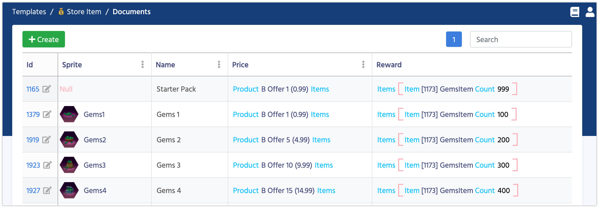

# Other Templates

In the Smart Offers package there are some additional templates, which we need to cover in this section

### Item

An Item Document represents one entity within your game. It can be a sword, shield, wood, stone - anything from your game.

Name              | Description
------------------|------
**Name**          | The name of the Item
**MaxStack**      | The maximum amount of Item, which can be put in one Slot

We want to keep this structure as universal as possible, thus we didn't add too many parameters.
However your game probably needs much more parameters than we offer. Just create a new Template inherited from **Item** and add as many parameters as you need.

### Store Item

This is what we actually sell in our offers.

Name              | Description
------------------|------
**Sprite**        | The image associated with this Store Item. Read more about [Data Objects](/data_editor/advanced/data_objects)
**Name**          | The name of the Store Item
**Price**         | The price of the current Store Item. It can contain soft or hard currencies.
**Reward**        | The list of **Items** with the amount you purchase.  

### Smart Config 

A singleton which store additional settings.

Name              | Description
------------------|------
**Offer Products** | Offers can have different prices and discounts, Balancy automatically finds the best product which can be associated with a specific Offer and Discount pair. Balancy search for the product from this very list.

### Item With Amount

This structure holds a link to an **Item** and it's quantity **Count**. Negative value for **Count** will be replaced with the **MaxStack** value of the **Item** in the code. This is especially convenient when you are going to change MaxStacks.

#### [Next: Conditions](/smart_offers/extra/conditions)
