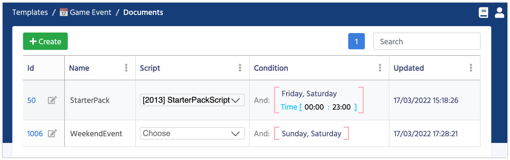

# Game Events

Game Event is the first step for launching Game Offers. However Game Events have much broader meaning. You can use them to plan your in-game activities and events like Halloween, Tournaments, Weekends, and much more.
Adding Game Events increase your games retention and engagements.

After installing SmartOffers plugin, you get a ready to use structure for Game Events, and the table look like this:


 Name              | Description
------------------|------
**Name**          | This name is used mostly for your convenience
**Script**        | The link to the script, which is executed once the event starts. Script can have any logic, but generally it's used to Segment players and give them Personalized Offers. You can read more in [Visual Scripting](/smart_offers/visual_scripting/basic) section
**Condition**     | Conditions which are required to meet in order to start the event. Leave it blank if you want to run this event all the time - this approach works for Starter Pack Offers. But if you have seasonal, weekend or game's anniversary events - you should specify the conditions. In most cases the conditions are time based. 


### Section for programmers

When an Game Event starts/finishes the events in code are triggered. You can subscribed for such events if you need to run any additional logic:  

```csharp fct_label="Unity"
Balancy.ExternalEvents.SmartObjects.NewEventActivatedEvent += eventInfo =>
{
    Debug.Log("New Event Started " + eventInfo.GameEvent.Name);
};
```

```csharp fct_label="Unity"
Balancy.ExternalEvents.SmartObjects.EventDeactivatedEvent += eventInfo =>
{
    Debug.Log("Event Finished " + eventInfo.GameEvent.Name);
};
```


Loading user's profile with all the events and offers is an asynchronous process, you should wait until the loading is done before using any methods. Below is an example of the code, which waits until all the data is loaded and then requests all active Game Events. You should use this method when your game starts to check all active Events: 

```csharp fct_label="Unity"
Balancy.ExternalEvents.SmartObjects.SmartObjectsInitializedEvent += () =>
{
    Debug.Log("Smart Objects initialized");
    var activeEvents = Balancy.SmartObjects.Manager.GetActiveEvents();
    Debug.Log("Active Events count: " + activeEvents?.Length);
};
```

#### [Next: Visual Scripting](/smart_offers/visual_scripting/basic)
