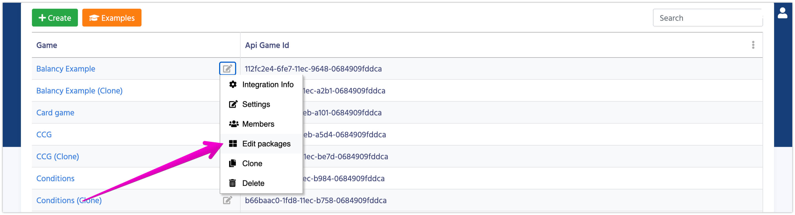

# How to Start

*   Open Dashboard and find your game.
*   Click on the button to the right from your game's name and select option **Edit Packages**.

*   Find the package **SmartOffers** and Install it.

*   Once the package installed, you'll see all the new Documents sections in your Navigation panel.
*   The best ways to learn how everything works is through the example project. Open **Examples** from the **Dashboard** and follow the instructions.

#### [Next: Overview](/smart_offers/overview)
