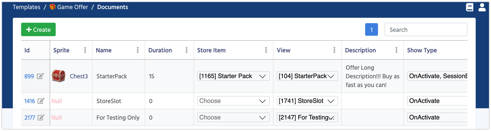

# Smart Offers

Special offers (aka Personalised Offers) can make the most money for your company and bring the biggest value for your customers. Besides making money, they can serve other purposes as well, like pushing players to make their  first purchase or to retain a player, who is about to churn.

*   New player completes the first level -> offer them a Starter Pack.
*   Player is playing for 3 days and doesn’t make a single purchase-> Offer them a time-limited pack with a huge discount to convert them to paying users.
*   Player lost 3 matches in a row -> Offer them a Power Booster.
*   Player pays a lot -> hide all cheap offers and show more expensive ones.

Such a list is limited only by your imagination. You shall be testing a lot of such offers during LiveOps. Personalised offers are very hard to implement and require a lot of knowledge from the team, but this is the future for all the gaming industry. 

Thanks to Balancy you already have all the tools you need to start your experiments.



 Name              | Description
------------------|------
**Sprite**        | The image associated with this Offer. Read more about [Data Objects](/data_editor/advanced/data_objects)
**Name**          | The name of the Offer
**Duration**      | How long will the offer be available to a user after the initial offering. (In seconds)
**Store Item**    | Defines what you are selling in this offer. Read more about [Store Item](/smart_offers/extra/other_templates) 
**View**          | The window which will be shown once the offer is activate. Read more about [Smart Windows](/smart_offers/smart_windows)
**Description**   | A detailed information about the offer
**Show Type**     | Defines when the offer window is being shown. On Activation and/or when a new Session starts.

### Extension

If your game requires any additional parameters, you should inherit a new Template from **GameOffer** and add as many parameters as you need. New Template creates a new section in navigation though.


### Section for programmers

When a Game Offer starts the event in code is triggered. You can subscribed for such event if you need to run any additional logic:  

```csharp fct_label="Unity"
Balancy.ExternalEvents.SmartObjects.NewOfferActivatedEvent += offerInfo =>
{
    Debug.Log("New Offer Activated " + offerInfo.GameOffer.Name);
};
```

And when the Game Offer ends:

```csharp fct_label="Unity"
Balancy.ExternalEvents.SmartObjects.OfferDeactivatedEvent += (offerInfo, wasPurchased) =>
{
    Debug.Log("Offer Deactivated " + offerInfo.GameOffer.Name + " reason purchase = " + wasPurchased);
};
```

When the Offer tries to show it's Window automatically, it'll ask your permission first:

```csharp fct_label="Unity"
ExternalEvents.UI.CanShowOfferWindow = info =>
{
    //return false if you don't want to show the default window at all or the time is not appropriate
    //SmartWindows.ShowOfferWindow(info); Call this method if you returned 'false' in CanShowOfferWindow before and now ready to show the missed offer
    return true;
};
```

Loading user's profile with all the events and offers is an asynchronous process, you should wait until the loading is done before using any methods. Below is an example of the code, which waits until all the data is loaded and then requests all active Game Offers. You should use this method when your game starts to check all active Offers: 

```csharp fct_label="Unity"
Balancy.ExternalEvents.SmartObjects.SmartObjectsInitializedEvent += () =>
{
    Debug.Log("Smart Objects initialized");
    var activeOffers = Balancy.SmartObjects.Manager.GetActiveOffers();
    Debug.Log("Active Offers count: " + activeOffers?.Length);
};
```

Visit the [Payments](/basic/payments) section to read how you can purchase Offers.

#### [Next: Smart Windows](/smart_offers/smart_windows)
