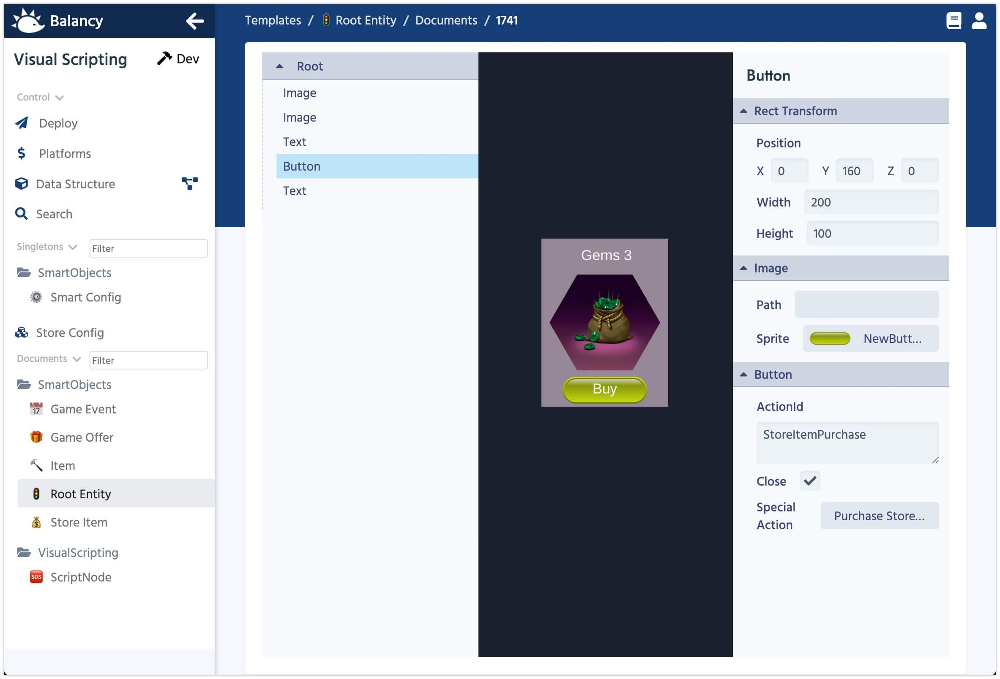

# Smart Windows

All Windows are store in **Root Entity** section, and you can access it from the left Navigation panel.

When you click on a Window document, the UI Editor will show up and open your Window.
You can add Text, Images and Buttons for now. You can specify a direct value for Text or Sprite or you can take that information for any Document using **Path** setting: for example you can assign a parameter **Sprite** of the Offer to the main Image. That will help you to reuse the same Window for multiple Offers.

#### [Next: Game Events](/smart_offers/other_templates)
