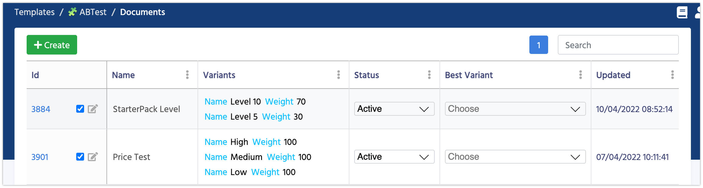

# A/B Tests

    A/B testing is a way for developers to run a controlled experiment between two or more versions of something in their game to determine which is more effective. Your audience is segmented into two or more groups, the control group (current performance – no changes) and your test group.

A/B testing is a great way to find the best pricing, game difficulty or test any of your hypothesis.



Before using all AB Tests must be added to the table.

Name              | Description
------------------|------
**Name**          | The name of the Test.
**Variants**      | Each user gets one random variant. The chance depends on the variant weight.
**Best Variant**  | Is used when AB Test is over and you want to specify the best performed variant. 
**Status**        | **Active** - the Test is running. **Inactive** - the test was cancelled or wasn't yet started. **Finished** - the test is finished, all new users will automatically be assigned to the **Best Variant**, meanwhile old user won't change their variant. **FinishedWithChange** - the test is finished and all users, including the old ones, will change their variant to the **Best Variant**

There are currently 3 ways to work with A/B testing:

1.  [Conditions](/smart_offers/extra/conditions)
2.  Use the **AB Test** Node in Visual Scripting
3.  Make your own logic


### Section for programmers

After the initialization of the SmartObjects, you can get all current A/B tests and their values for the user. 

```csharp fct_label="Unity"
ExternalEvents.SmartObjects.SmartObjectsInitializedEvent += () =>
{
    //In this callback all A/B Tests were already loaded and assigned
    var allTests = AbTestsManager.GetAllTests();
    Debug.LogWarning("All Tests " + allTests.Count);
    foreach (var test in allTests)
        Debug.Log("Name = " + test.AbTest.Name + " ; Variant = " +test.Variant.Name + " ; isFinished = " + test.Finished);
};
```

#### [Next: Smart Offers](/smart_offers/smart_offers)
