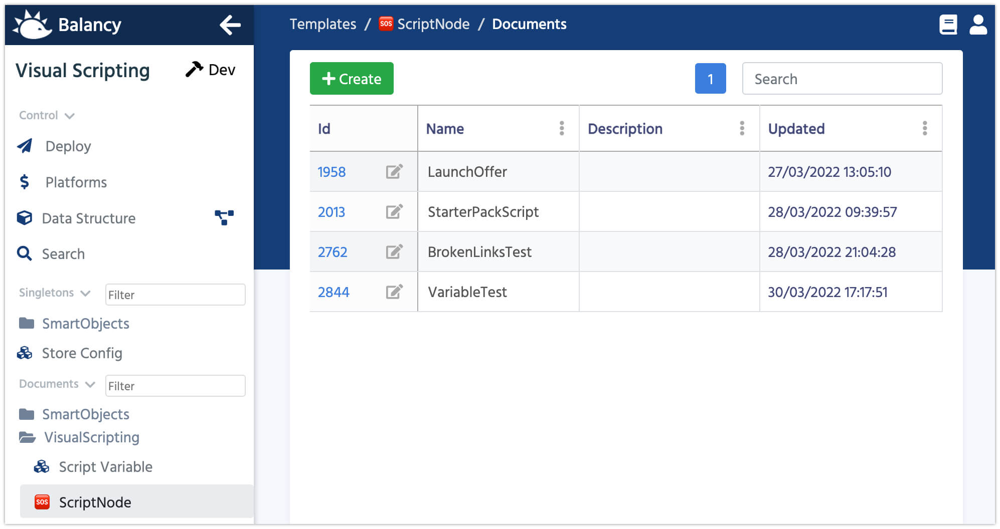
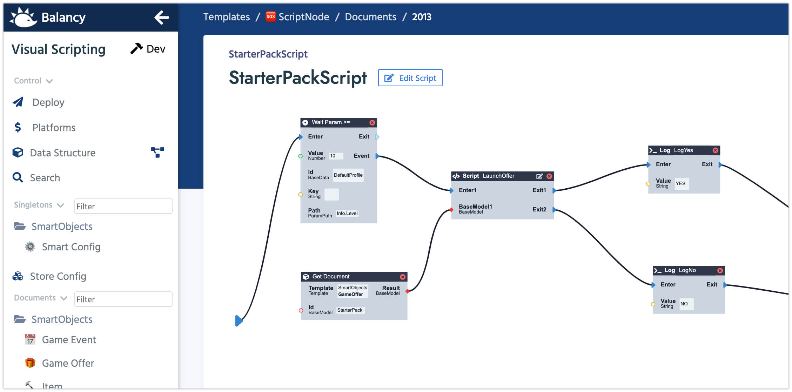

# Visual Scripting

Visual Scripting is a tool designed to make the entry barrier to programming much lower. As code is more visual, it needs less abstract thinking to be understood. Any game designer or game analytic can look at it and quickly understand the flow of logic.

We've added VS to Balancy, so you could segment and limit your game offers, to make sure the right player gets the right offer. The first version os VS is pretty limited, but we are planing to expand it in the future, so you could use it for anything, even game logic.
The best part of VS is that it let your designers to manipulate with game logic remotely and without distracting your engineering team.

 Name             | Description
------------------|------
**Name**          | This name is used mostly for your convenience
**Description**   | Helps other team members quickly understand the purpose of the Script

When you click on an ID of any Script, the Visual Scripting tool will launch and open the selected Script. 

1.  Click on **Edit Script** to change Script's name and add/remove script Ports.
2.  Right Click on the canvas to add a new Node. Each Node executes a specific logic.
3.  You can connect ports of different nodes to define the logic flow.
4.  On the right side there is variables section. You can add new variables there. Drag and Drop variable to the canvas to operate with them in the Script.
5.  Each Script starts with the Enter Port and should and at the exit port.

We provide Several Scripts as Examples - they are the best place to start learning how it works.
Once the script is ready you can link it to the [GameEvent](/smart_offers/game_events)

#### [Next: Smart Objects](/smart_offers/visual_scripting/smart_objects)
