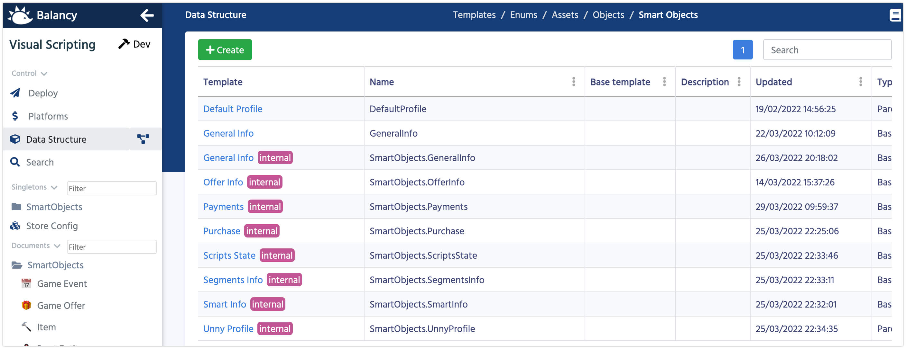
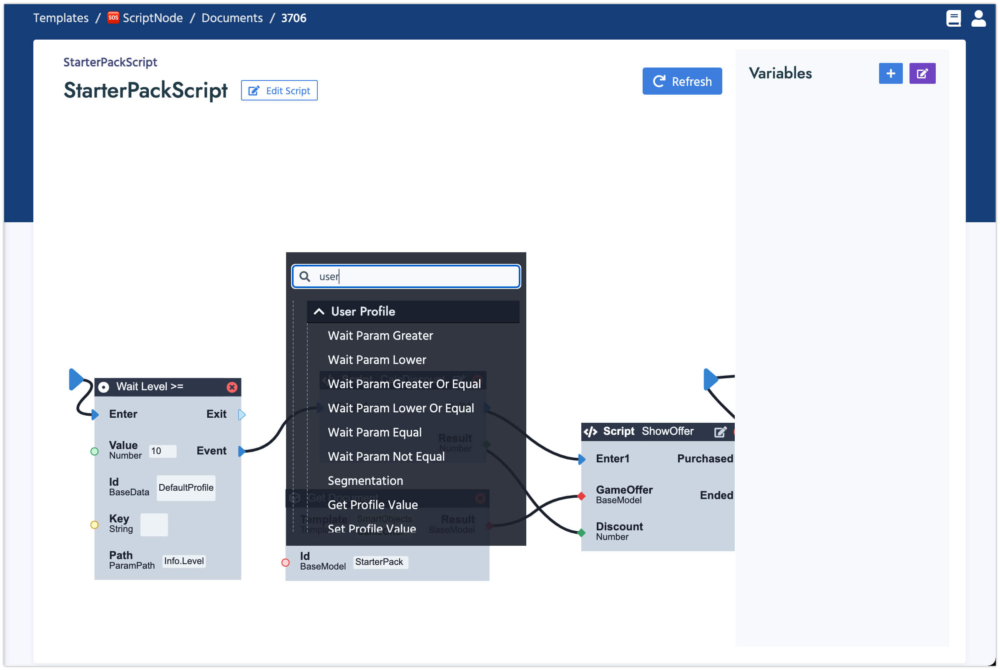

# Smart Objects

**Smart Objects** is a new section, where you can create your user's profile.



This section works very similar to **Templates** section, so you should be very familiar.
You can create 2 types of Smart Objects: 

*   **ParentBaseData** - the root element for your player's profile. It can have parameters of type BaseData only.
*   **BaseData** - additional layer, which will be stored in one or many **ParentBaseData**. It can have parameters of single types only  (temporary): int, float, string, bool. 

When you specify a profile, you can start using it in Visual Scripting. For example you can store player's level, gold coins, attribution campaign, etc... in the profile and then use that data to segment players and decide which Offer you want to give to the player.

In the nodes section **User Profile** you can find a bunch of Nodes to work with the profile.



*   **WaitParam...** nodes awaits until the specified field in the profile will reach certain condition. For example Level >= 10.
*   **GetProfileValue** returns the value of the specified field. For example **Level** or **GoldCount**.
*   **SetProfileValue** changes the value of the specified field in the profile.

### Section for programmers

You need to load player's profile in order to make operations with it. Don't forget to [generate the code](/data_editor/code_generation) every time you make changes in the structure of Smart Objects.

```csharp fct_label="Unity"
Balancy.SmartStorage.LoadSmartObject<DefaultProfile>(null, responseData =>
{
    var profile = responseData.Data;
});
```

**LoadSmartObject** method has the last parameter **DataSynchType**, which determines where the data is saved.
 
*   Local data is saved every 5 seconds
*   Cloud data is saved every 20 seconds

If no data was changed, save is not called.

If you select **LocalAndCloud**, the data is saved everywhere, which means that data conflicts might appear. 
After loading the **Profile** you should always check if there is already a conflict:

```csharp fct_label="Unity"
if (profile.ConflictsManager.HasConflict()) {
    // profile <-- Local profile Data is here
    // profile.ConflictsManager.ConflictData; <-- Cloud Profile Data is here
    // profile.ConflictsManager.SolveConflict(ConflictsManager.VersionType.Cloud);
}
```

Conflict might appear in the middle of the session, for example if there was no internet connection at first, so cloud profile was loaded later. To cover this case you should subscribe to the following events:

```csharp fct_label="Unity"
profile.OnConflictAppeared += () =>
{
    //Show a window so user could choose one of two Profiles  
};

profile.OnNewerVersionAppeared += () =>
{
    //Inform a user about the newer version and restart the game with it
    profile.ConflictsManager.SolveConflict(ConflictsManager.VersionType.Cloud);
};
```

#### Profile Restart

If you have your own Smart Object, for example **DefaultProfile**, you can reset it by calling:

```csharp fct_label="Unity"
SmartStorage.ClearSmartObject<DefaultProfile>(<key>);
```

where key is the same key you used to load **DefaultProfile**. In most cases it's just **null**.

If you need to reset the System Profile, which stores all the Scripts, Events, Offers, A/B testing, Payments and Segmentations: 

```csharp fct_label="Unity"
UnnyProfileManager.Restart();
```

This method is asynchronous. All the callbacks will be called once again after the Reset is complete:

```csharp fct_label="Unity"
Balancy.ExternalEvents.SmartObjects.SmartObjectsInitializedEvent += () =>
{
    //It's called at the game start, when profile is ready and after the Restart.
};
```

If you clear any profile or restart the System Profile, make sure to update all the links to them in your game, reloading the Profiles.

#### [Next: Segmentation](/smart_offers/visual_scripting/segmentation)
