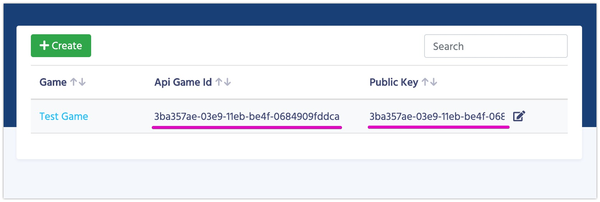

# Интеграция с Unity3D

Для удобства мы записали [отдельное видео об интеграции](https://youtu.be/91JYYb1KVIY)

1.  Скачайте последнюю версию из [Магазина ассетов](https://assetstore.unity.com/packages/slug/128920).
2.  Или воспользуйтесь прямой ссылкой на [package](https://dictionaries-unnynet.fra1.cdn.digitaloceanspaces.com/config/Packages/balancy_latest.unitypackage).
3.  Импортируйте Balancy плагин.
4.  Подготовьте Game ID и Public Key для использования в коде:

    

5.  Call initialize method at start:
        
```csharp fct_label="Unity"
Balancy.Main.Init(new Balancy.AppConfig {
    ApiGameId = YOUR_GAME_ID,
    PublicKey = YOUR_PUBLIC_KEY,
    Environment = Balancy.Constants.Environment.Development,
    OnReadyCallback = responseData => { Debug.Log("Balancy Initialized: " + responseData.Success); }
});
```

### Что дальше

Для удобства Balancy разбит из нескольких модулей.

1. [**Auth**](/basic/authorization) — различные способы авторизации.
2. [**Data Editor**](/data_editor/basic) — место для работы с игровым балансом
3. [**Payments**](/basic/payments) — работа с внутриигровыми покупками.
4. **Localization** — (будет в будущем) возможность настроить локализацию игры.
