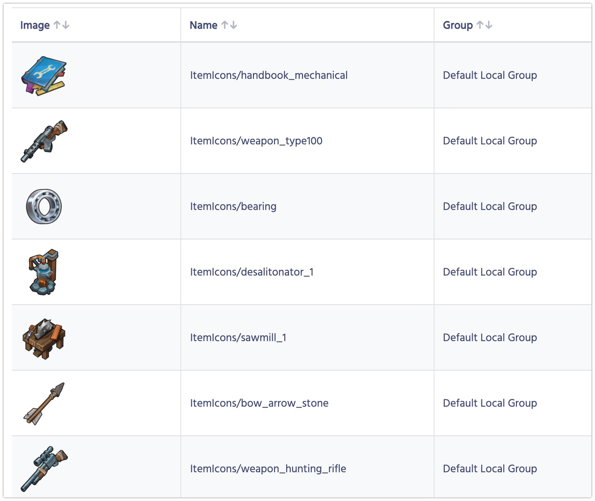
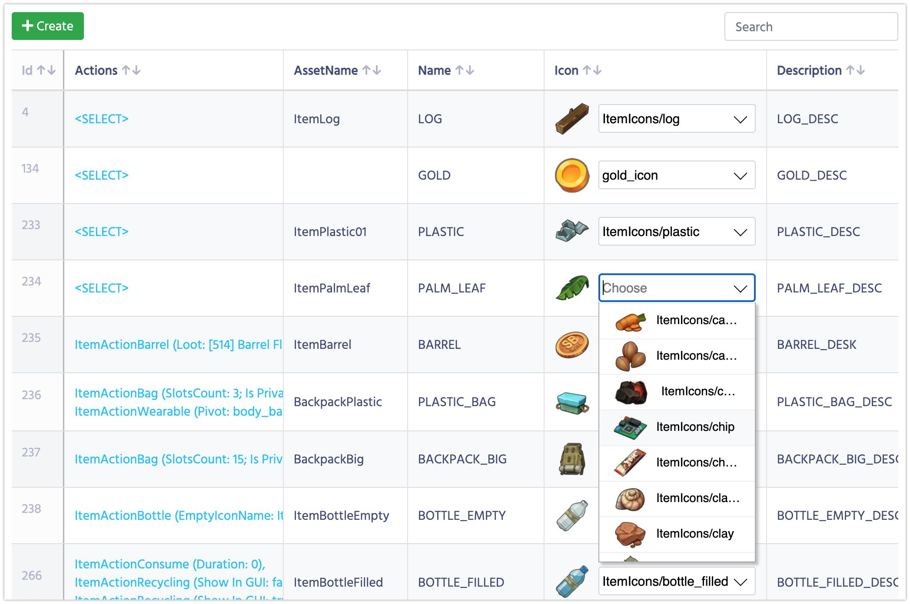

# Ассеты

Ассеты — это объекты, которые вы храните как Addressables. Если вы не используете Addressables в своей игре, вам следует игнорировать эту страницу. А лучше уже начать их использовать.

1. В Unity откройте **Balancy->Tools** и нажмите **Synch Addressables**.
2. Начнётся процесс синхронизации.
3. Balancy определит, какие ассеты были изменены после последней синхронизации, и загрузит изображения только для новых/изменённых файлов. Это означает, что первая синхронизация может занять некоторое время, а все последующие будут быстрее.
4. После завершения процесса откройте раздел **Data Structure -> Assets** в DE, там вы должны увидеть список всех ваших ассетов.

    

5. Если у вас есть параметр типа **Asset**, вы сможете выбрать его из раскрывающегося меню:

    

6. В сгенерированном коде ваш параметр будет иметь тип **UnnyAsset**. Пока в нём есть только одно поле **Имя**, которого разработчику достаточно для загрузки ассета. 
