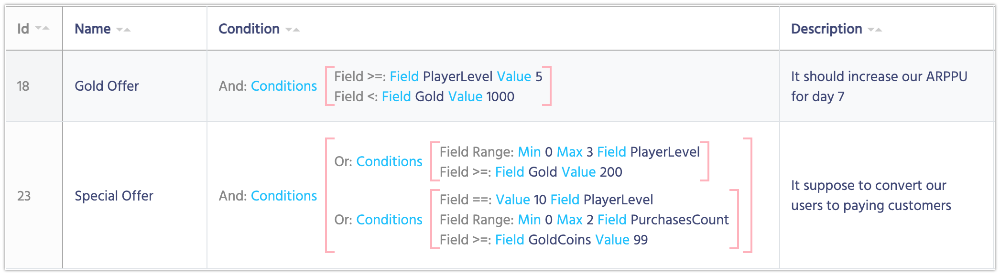
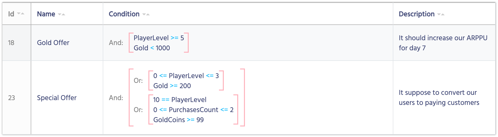

# Формат отображения

Представьте, что у вас очень сложная структура условий на базе Компонентов. Выглядеть это будет примерно так:

Вы можете легко изменить формат отображения ваших компонентов, не внося никаких изменений в логику.

1. Откройте шаблон, который хотите изменить.
2. Выберите **Custom display format**.
3. **Display format** станет доступным для редактирования.
4. Используйте следующий код для настройки отображения:

    Name              | Description
    ------------------|------
    **{template.displayName}**          | Вместо этого будет использовать параметр Display Name.
    **{< Имя параметра >}**  | Поместите <Имя параметра> в скобки {}, и оно будет заменено фактическим значением параметра.
    **любая строка** | Остальная информация будут оставлена без изменений. Вы можете использовать строки, числа или любые другие символы.

<iframe width="560" height="315" src="https://www.youtube.com/embed/eiNQBAZYswk" title="YouTube video player" frameborder="0" allow="accelerometer; autoplay; clipboard-write; encrypted-media; gyroscope; picture-in-picture" allowfullscreen></iframe>
