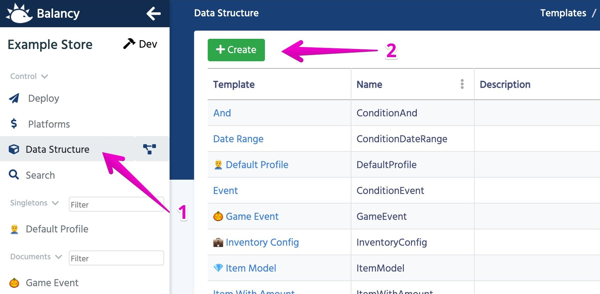
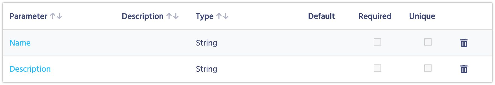
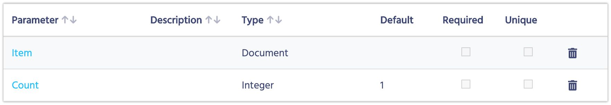
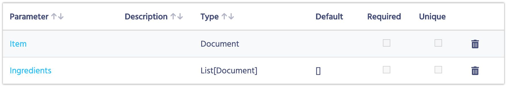
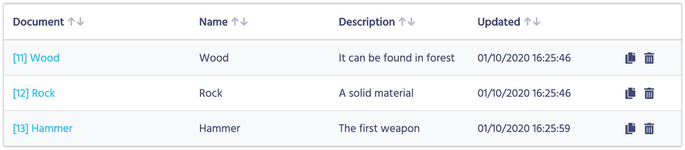
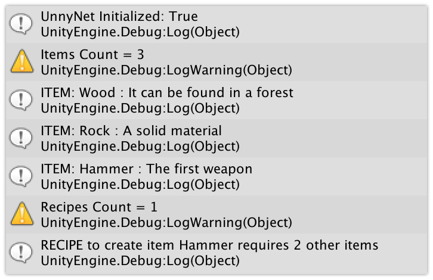

# Пример использования редактора

В этом примере мы покажем, как можно создать простую логику крафта для своей игры. Нам понадобится всего несколько шаблонов: Item, Recipe и Ingredient.
Перед этим рекомендуем сначала ознакомиться с [основами](/basic/basic).

<iframe width="560" height="315" src="https://www.youtube.com/embed/91JYYb1KVIY" title="YouTube video player" frameborder="0" allow="accelerometer; autoplay; clipboard-write; encrypted-media; gyroscope; picture-in-picture" allowfullscreen></iframe>

### Подготовка шаблонов

1. Откройте Data Editor
2. Выберите раздел Templates и нажмите Create Template

3. Введите "Item" в поле для **Name**. Остальные поля оставляем со значениями по умолчанию.
4. Добавьте следующие параметры шаблону:
    * **Name**: (Type: String, поставьте чекбокс напротив "Use in display name")
    * **Description**: (Type: String)
    * Когда закончите, список параметров должен выглядеть так:
      
5. Создайте другой шаблон с именем Ingredient. Поменяйте ему тип на Component.
    * **Name**: Ingredient
    * **Type**: Component
6. Добавьте следующие параметры:
    * **Item**: (Type: Document, Reference Template: Item)
    * **Count**: (Type: Integer, Default value: 1)
    * Когда закончите, список параметров должен выглядеть так:
    
7. Последний шаблон, который нам понадобится, это Recipe. В поле**Name** впишите "Recipe", а остальные поля оставьте по умолчанию.
8. Добавьте следующие параметры:
    * **Item**: (Type: Document, Reference Template: **Item**)
    * **Ingredients**: (Type: List, List Type: Document, Reference Template: **Ingredient**)
    * Когда закончите, список параметров должен выглядеть так:
    

### Создание документов

Теперь, когда у нас есть готовые шаблоны, нам нужно добавить пару реальных предметов и рецептов. После добавления шаблонов в навигации (слева) появилось два новых раздела: Items и Recipe. Ингредиент не отображается, потому что это компонент и существует только в контексте других документов.

1. На панели навигации выберите **Items**
2. Нажмите кнопку **Create**, чтобы добавить новый документ.
3. Создайте 3 документа, как показано ниже:
   

Теперь мы добавим рецепт создания Молота с использованием камня и дерева:

1. На панели навигации выберите **Recipe**.
2. Нажмите кнопку **Create**, чтобы добавить новый рецепт.
3. Выберите параметр Item как Hammer.
4. Добавьте 2 ингредиента: дерево и камень.
5. Так мы задали, что для создания Молота вам нужно потратить одно дерево и один камень.

Теперь нам просто нужно опубликовать наши изменения.

### Публикация

1. Выберите раздел «Deploy» на панели навигации.
2. Нажмите **Deploy** и подождите несколько секунд, пока всё не будет готово.

Каждый раз, когда вы вносите какие-либо изменения в данные, они сохраняются только в рамках редактора. Если вы хотите, чтобы изменения попали в игру, вы можете сделать это в разделе «Deploy».

### Генерация кода

1. Откройте проект в Unity
2. Импортируйте [плагин](https://assetstore.unity.com/packages/slug/128920)
3. Откройте окно редактора Tools->UnnyNet
4. Введите GameId и PublicKey
5. Нажмите **Generate Code** (это может занять несколько секунд)
6. После завершения процесса у вас появится директория с несколькими скриптами, созданными в /Assets/UnnyNet/AutoGeneratedCode
7. Ничего не меняйте в этой папке. Все изменения будут потеряны после следующей генерации

### Инициализация UnnyNet

Можете почитать про это в [отдельной статье](/basic/integration_unity3d)

1. Создайте новый скрипт DataEditorExample.cs
2. Создайте новую сцену и навесьте этот скрипт на Main Camera.
3. В методе Start mнапишите код:

```
UnnyNet.UnnyNetNewInit.Init(new UnnyNet.AppConfig
{
   ApiGameId = YOUR_GAME_ID,
   PublicKey = YOUR_PUBLIC_KEY,
   Environment = UnnyNet.Constants.Environment.Development,
   OnReadyCallback = responseData =>
   {
       Debug.Log("UnnyNet Initialized: " + responseData.Success);
   }
});
```
       
### Валидация данных

Во-первых, давайте проверим, получаем ли мы правильные данные от редактора.
Добавьте эти методы в наш скрипт:

```
private void PrintAllData()
{
    PrintItems();
    PrintRecipes();
}

private void PrintItems()
{
    var items = UnnyNet.DataEditor.Items;
    Debug.LogWarning("Items Count = " + items.Count);
    foreach (var item in items)
        Debug.Log("ITEM: " + item.Name + " : " + item.Description);
}

private void PrintRecipes()
{
    var recipes = UnnyNet.DataEditor.Recipes;
    Debug.LogWarning("Recipes Count = " + recipes.Count);
    foreach (var recipe in recipes)
        Debug.Log("RECIPE to create item " + recipe.Item.Name + " requires " + recipe.Ingredients.Length + " other items");
}
```

Теперь нам просто нужно вызвать **PrintAllData** после инициализации UnnyNet. Вызовите этот метод после метода по выводу в консоль:

```
Debug.Log("UnnyNet Initialized: " + responseData.Success);
PrintAllData();
```

После запуска игры вы должны увидеть в консоли следующие логи:



### Написание логики по крафту

Следующим шагом будет написание логики для хранения имеющихся у вас предметов и их использования для изготовления предметов. Мы предоставим полный листинг, чтобы вы могли его изучить. Имейте в виду, что этот пример был специально сделан очень простым. Для реального проекта вы определённо захотите лучше организовать код. И не забывайте о [принципах SOLID](https://en.wikipedia.org/wiki/SOLID).

[DataEditorExample.cs](/code/DataEditorExample.cs) 

### Оффлайн игры

Если вы работаете над оффлайн игрой и считаете, что игра может быть запущена в первый раз без доступа к Интернету, то в такой ситуации нельзя рассчитывать, что баланс будет скачан игрой.

1. Откройте окно редактора Tools->UnnyNet.
2. Нажмите **Download Data**.
3. Все актуальные игровые данные из редактора будут загружены и помещены в /Assets/UnnyNet/Resources.
4. Если ваша игра будет запущена без доступа в Интернет, она будет использовать эти данные из ресурсов.
5. Как только Интернет станет доступен, данные будут автоматически обновляться при запуске игры.

#### [Далее: что дальше](/data_editor/what_next)
