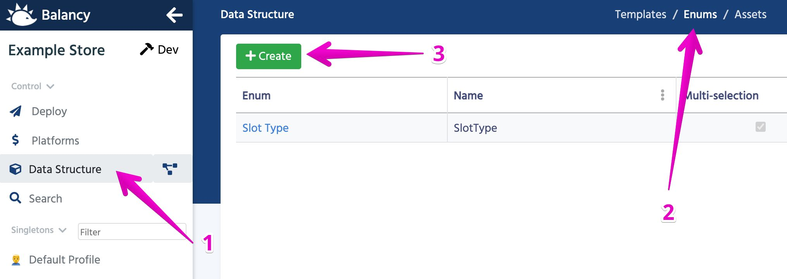

# Перечисления (enums)

### Обзор

[Перечисляемый тип](https://ru.wikipedia.org/wiki/%D0%9F%D0%B5%D1%80%D0%B5%D1%87%D0%B8%D1%81%D0%BB%D1%8F%D0%B5%D0%BC%D1%8B%D0%B9_%D1%82%D0%B8%D0%BF) широко используется в программировании. Когда у вас ограниченный список возможных значений, часто удобно использовать **enum** вместо **int** или **string**.

##### Например:
Если у вас есть ограниченный набор цветов на выбор в вашей игре, вы можете сохранить значение как целое число (1,2,3,4, ...) для экономии памяти. Однако вы можете определить новое перечисление, которое сделает ваши значения более читабельными и удобными в использовании.

```
public enum Color
{
    Red = 0,
    Green = 1,
    Blue = 2,
    White = 3,
    Black = 4,
}
```

Теперь вы можете обращаться к значениям как **Color.Blue** вместо просто использования константы равной **2**.

### Как создать перечисление

1. Выберите **Data Structure** в левом меню в редакторе.
2. Переключитесь в подраздел **Enums**.
3. Нажмите **Create**.


4. Каждое перечисление имеет несколько параметров
    
    Name | Description
    -----|------------
    **Name** | Это имя используется при работе в коде.
    **Display Name** | Имя, отображаемое в редакторе
    **Description** | Помогает другим членам команды понять, для чего используется это перечисление.
    **Multi-selection** | определяет, может ли параметр содержать несколько значений.

5. Таблица значений

    Каждое значение перечисления должно иметь уникальное имя и уникальное значение, связанное с именем. Если вы используете множественный выбор, все значения должны быть степенью 2 или равны нулю.

6. После сохранения вы сможете выбрать это перечисление как тип параметра.


#### [Далее: Публикация](/data_editor/deploy)
