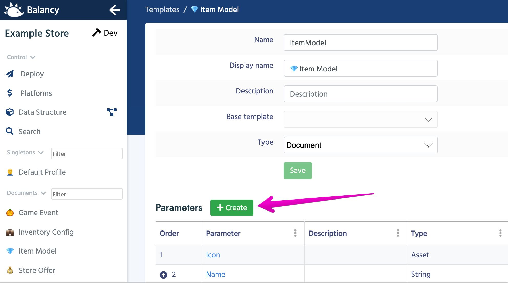

# Параметры

**Параметр** описывает часть документа, хранящую некоторое значение. У каждого параметра есть имя и тип. Тип может быть простым, например, string, int, float, bool или ссылкой на любой другой шаблон. Как программист, вы можете думать о параметре как о поле или свойстве класса.

1.  После создания шаблона ему можно добавлять параметры.

2. На странице параметров вы можете просмотреть/отредактировать все существующие параметры и добавить новые.

2. У каждого параметры есть базовые аттрибуты:

    Name              | Description
    ------------------|------
    **Name**          | Именно это имя используется при генерации класса. Чтобы все было в одном стиле, мы советуем вам использовать именование [CamelCase](https://ru.wikipedia.org/wiki/CamelCase).     Например: MainTag, ConstructionId, HeroType, ...
    **Display Name**  | Это имя будет отображаться в DE для вашего удобства.     Например: Main Tag, Construction Id, Hero Type, ...
    **Description** | Помогает другим членам команды легко понять, для чего используется этот параметр.
    **Use In Display Name** | Означает, что этот параметр будет отображаться в поиске и ссылках для соответствующего документа. Обычно для этого выбирается поле **Name** (если есть) или любой другой уникальный строковый параметр, который поможет вам мгновенно понять, что это за экземпляр. Не применимо к параметрам Компонента. Подробнее[здесь](/data_editor/advanced/display_format).
    **Is required** | Отмечает параметр как обязательный. Этот флаг поможет убедиться, что вы не забудете добавить необходимую ссылку или значение.
    **Is unique** | Используется в том случае, если вы хотите, чтобы значение параметры в ваших документах не могло совпадать.
    **Default Value** | Значение, которое будет присвоено по умолчанию при создании нового документа.
    **Type** | Тип параметра. Возможные варианты представлены ниже.

    Type | Description
    -----|------------
    [Integer](https://ru.wikipedia.org/wiki/%D0%A6%D0%B5%D0%BB%D0%BE%D0%B5_%D1%87%D0%B8%D1%81%D0%BB%D0%BE) | Целое число. Пример: 1, 2, 999, -200
    [Float](https://ru.wikipedia.org/wiki/%D0%A7%D0%B8%D1%81%D0%BB%D0%BE_%D1%81_%D0%BF%D0%BB%D0%B0%D0%B2%D0%B0%D1%8E%D1%89%D0%B5%D0%B9_%D0%B7%D0%B0%D0%BF%D1%8F%D1%82%D0%BE%D0%B9) | Число с плавающей запятой. Пример: 1.32, -0.7432
    [Boolean](https://ru.wikipedia.org/wiki/%D0%9B%D0%BE%D0%B3%D0%B8%D1%87%D0%B5%D1%81%D0%BA%D0%B8%D0%B9_%D1%82%D0%B8%D0%BF) | Логический тип: true или  false
    [String](https://ru.wikipedia.org/wiki/%D0%A1%D1%82%D1%80%D0%BE%D0%BA%D0%BE%D0%B2%D1%8B%D0%B9_%D1%82%D0%B8%D0%BF) | Любой текст. Пример: "Hello World", "-+ ta-ta_!! 55"
    [Enum](/data_editor/getting_started/enums) | Перечисление. Можно выбирать из заранее заданных значений.   
    [Document](/data_editor/getting_started/documents) | Ссылка на существующий документ.
    List | Массив(список) других значений
    [Asset](/data_editor/getting_started/assets) | Ссылка на существующий ассет. Обычно это префаб, спрайт или другой объект, который хранится в Unity как Addressable.

#### [Далее: документы и компоненты](/data_editor/getting_started/documents)
